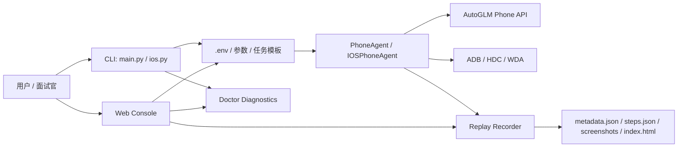

# BetterGLM 求职展示文档

BetterGLM 是基于 Open-AutoGLM 的手机 Agent 工程化 fork。这个 fork 的重点不是重新训练模型，而是把一个能跑的研究项目包装成更容易部署、诊断、复盘和演示的工程作品。

## 一句话介绍

BetterGLM 为手机端 AI Agent 增加了环境诊断、运行回放、本地 Web 控制台和任务模板，让 Agent 从“命令行 demo”升级为“可复现、可观察、可演示”的工程化项目。

## 为什么做这些功能

| 功能 | 解决的问题 | 展示的能力 |
| --- | --- | --- |
| Doctor 一键诊断 | iOS/WDA/模型 API/依赖经常因为环境问题跑不起来 | 工程排障、开发者体验、错误提示设计 |
| iOS WiFi-only 支持 | WDA 明明可用，但没有 USB 设备时 CLI 误退出 | 对真实设备链路的理解和兼容性处理 |
| CLI 输入增强 | 中文终端输入、历史记录、编辑体验差 | 用户体验细节、跨终端兼容 |
| 动作解析失败重试 | 模型输出不规范时误判任务完成 | Agent 鲁棒性、异常恢复 |
| 日志回放 | 任务失败后不知道哪一步出错 | 可观测性、问题复盘、质量评估 |
| Web 控制台 | 命令行不适合面试演示和非技术用户试用 | 产品化包装、前后端集成、异步任务状态 |
| 任务模板 | 每次临时输入任务，难以复现和对比 | 场景库、评测思维、演示标准化 |

## 架构概览



## 推荐演示流程

1. 运行 Doctor，证明环境可诊断。

   ```bash
   python ios.py --doctor --doctor-skip-model
   ```

2. 查看任务模板，说明项目有标准化场景库。

   ```bash
   python ios.py --list-templates
   ```

3. 启动 Web 控制台，展示产品化入口。

   ```bash
   python ios.py --web
   ```

4. 在 Web 控制台中点击模板并运行任务。

5. 打开回放 HTML，解释每一步截图、模型动作和执行结果。

## 命令行示例

```bash
# 直接跑一个模板，并把城市变量改成上海
python ios.py --template ios_safari_weather --template-var city=上海 --replay-dir runs

# 使用自定义模板文件
python ios.py --templates-file examples/task_templates.json --template portfolio_demo_weather

# 使用通用入口运行 iOS 设备
python main.py --device-type ios --template ios_settings_wifi
```

## 自定义任务模板格式

```json
{
  "templates": [
    {
      "id": "portfolio_demo_weather",
      "title": "Portfolio demo weather search",
      "device_type": "ios",
      "prompt": "打开 Safari 搜索{city}天气，并停留在搜索结果页",
      "purpose": "用于作品集录屏，展示稳定的应用启动、输入和页面理解链路。",
      "variables": {
        "city": "上海"
      },
      "tags": ["portfolio", "browser", "ios"]
    }
  ]
}
```

## 面试讲法

可以这样介绍项目：

> 我基于 Open-AutoGLM 做了一个手机 Agent 工程化 fork。原项目能完成手机自动化任务，但在真实部署、失败排查、演示复现方面比较弱。我补了 Doctor 诊断、iOS WiFi WDA 兼容、CLI 输入体验、模型动作解析失败重试、日志回放、本地 Web 控制台和任务模板。这个项目主要体现我对 AI Agent 工程落地的理解：不只是调模型，而是把模型调用、设备控制、异常处理、可观测性和演示产品化串起来。

## 简历 bullet 参考

- 基于 Open-AutoGLM 二次开发手机端 AI Agent，新增 iOS WDA 环境诊断、WiFi-only 连接兼容和模型动作解析失败重试，提升真实设备部署稳定性。
- 设计并实现 Agent 运行回放系统，按步骤保存截图、模型思考、动作、执行结果和耗时，支持失败复盘和演示归档。
- 实现无外部前端依赖的本地 Web 控制台，支持任务提交、Doctor 诊断、运行状态轮询、回放预览和任务模板选择。
- 建立可复现任务模板机制，支持内置模板、自定义 JSON 模板和变量覆盖，用于标准化 demo、回归测试和作品集展示。

## 后续可继续开发

| 方向 | 目的 |
| --- | --- |
| 回放对比 | 比较两次任务的步骤差异，用于回归测试 |
| 失败分类 | 把失败分成环境、模型、设备、权限、解析等类型 |
| 任务评分 | 给模板任务加成功条件，形成轻量 benchmark |
| WebSocket 状态推送 | 减少轮询，让 Web 控制台更实时 |
| 权限与隐私遮罩 | 对截图中的敏感区域做本地脱敏 |

## 项目边界

BetterGLM 仍然是研究和学习用途的手机 Agent 项目。不要把它用于绕过平台规则、抓取隐私信息、批量骚扰或任何违法场景。演示时优先选择 Safari、设置、备忘录这类低风险任务。
