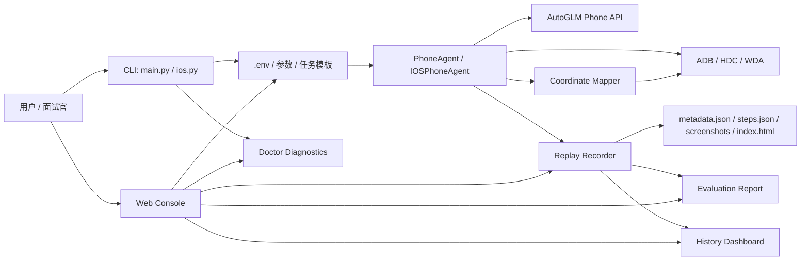

# BetterGLM 求职展示文档

BetterGLM 是基于 Open-AutoGLM 的手机 Agent 工程化 fork。这个 fork 的重点不是重新训练模型，而是把一个能跑的研究项目包装成更容易部署、诊断、复盘和演示的工程作品。

## 一句话介绍

BetterGLM 为手机端 AI Agent 增加了环境诊断、运行回放、本地 Web 控制台、历史 Dashboard 和任务模板，让 Agent 从“命令行 demo”升级为“可复现、可观察、可评测、可演示”的工程化项目。

## 为什么做这些功能

| 功能 | 解决的问题 | 展示的能力 |
| --- | --- | --- |
| Doctor 一键诊断 | iOS/WDA/模型 API/依赖经常因为环境问题跑不起来 | 工程排障、开发者体验、错误提示设计 |
| iOS WiFi-only 支持 | WDA 明明可用，但没有 USB 设备时 CLI 误退出 | 对真实设备链路的理解和兼容性处理 |
| CLI 输入增强 | 中文终端输入、历史记录、编辑体验差 | 用户体验细节、跨终端兼容 |
| 动作解析失败重试 | 模型输出不规范时误判任务完成 | Agent 鲁棒性、异常恢复 |
| 日志回放 | 任务失败后不知道哪一步出错 | 可观测性、问题复盘、质量评估 |
| Web 控制台 | 命令行不适合面试演示和非技术用户试用 | 产品化包装、前后端集成、异步任务状态 |
| 历史 Dashboard | 单次演示无法说明长期质量和失败分布 | 指标设计、质量看板、失败归因 |
| 任务模板 | 每次临时输入任务，难以复现和对比 | 场景库、评测思维、演示标准化 |
| 任务评分器 | 模型说完成不等于任务真的成功 | Agent 评测闭环、质量度量 |
| 点击精度审计 | 模型坐标、截图像素和设备触控坐标之间容易偏移 | 多模态 Agent 执行链路优化、可观测性 |

## 架构概览



## 推荐演示流程

1. 运行 Doctor，证明环境可诊断。

   ```bash
   python ios.py --doctor --doctor-skip-model
   ```

2. 查看任务模板，说明项目有标准化场景库。

   ```bash
   python ios.py --list-templates
   ```

3. 启动 Web 控制台，展示产品化入口。

   ```bash
   python ios.py --web
   ```

4. 在 Web 控制台中点击模板并运行任务。

5. 查看评分结果，说明系统如何从回放证据判断 passed/failed。

6. 查看历史 Dashboard，说明成功率、未评分完成、平均步数和失败类型如何帮助持续优化。

7. 打开回放 HTML，解释每一步截图、模型动作和执行结果。

## 命令行示例

```bash
# 直接跑一个模板，并把城市变量改成上海
python ios.py --template ios_safari_weather --template-var city=上海 --replay-dir runs

# 使用自定义模板文件
python ios.py --templates-file examples/task_templates.json --template portfolio_demo_weather

# 使用通用入口运行 iOS 设备
python main.py --device-type ios --template ios_settings_wifi

# 对已有回放重新评分
python ios.py --template ios_safari_weather --template-var city=北京 --evaluate-replay runs/<run-id>
```

## 自定义任务模板格式

```json
{
  "templates": [
    {
      "id": "portfolio_demo_weather",
      "title": "Portfolio demo weather search",
      "device_type": "ios",
      "prompt": "打开 Safari 搜索{city}天气，并停留在搜索结果页",
      "purpose": "用于作品集录屏，展示稳定的应用启动、输入和页面理解链路。",
      "variables": {
        "city": "上海"
      },
      "tags": ["portfolio", "browser", "ios"],
      "success_criteria": {
        "must_contain_text": ["{city}", "天气"],
        "target_app": "Safari",
        "max_steps": 12,
        "min_score": 80
      }
    }
  ]
}
```

## 评分器输出

评分器会读取回放目录里的 `metadata.json` 和 `steps.json`，生成 `evaluation.json`。它不是再调用一次大模型，而是根据确定性规则检查：

- 任务是否以 completed 状态结束
- 步骤里是否有执行错误
- 是否超过模板规定的最大步骤数
- 最终 App 是否符合预期
- 回放证据中是否出现成功关键词

这能把 Agent 演示变成可度量的结果：

```text
Status: passed
Score: 100/100
Checks:
- run_completed
- no_step_errors
- max_steps
- target_app
- must_contain_text
```

## 历史 Dashboard

Web 控制台会递归扫描 `runs` 下的回放目录，并通过 `/api/history` 汇总最近任务。这样 `runs/web`、`runs/smoke-test` 和 `runs/benchmark-*` 都会进入同一个历史 Dashboard：

- 总任务数、已评分任务数、评分通过率、未评分完成数
- 平均分、平均步数、平均耗时
- 每条任务的状态、分数、步数、失败类型和回放入口

失败类型来自回放元数据、步骤错误和评分报告，覆盖模型动作解析失败、WDA 连接异常、App 未安装、坐标执行异常、敏感动作拦截、超过最大步数、目标 App 不匹配、目标文本缺失等常见问题。

这件事在面试里可以这样讲：

> 我把单次 demo 变成了一个可持续观察的质量看板。每次 Web 控制台运行都会沉淀为 replay artifact，Dashboard 再按评分通过率、平均步数和失败类型汇总，帮助判断问题是环境、模型输出、坐标执行还是任务定义本身。

## 指标报告

项目提供 `scripts/replay_metrics.py`，可以把本地回放目录转换成作品集指标报告：

```bash
python scripts/replay_metrics.py \
  --runs runs \
  --output docs/betterglm_metrics_report.md \
  --json-output docs/betterglm_metrics_report.json
```

当前样例报告见：[BetterGLM 指标报告](betterglm_metrics_report.md)。这份报告基于真实 iPhone 任务回放，展示了模板覆盖、评分通过率、平均分、平均步数、失败类型、回放完整率、截图覆盖率和坐标审计覆盖率。

## 点击精度优化

手机 Agent 的“点不准”通常不是一个单点问题，而是链路问题：

```text
模型 0-1000 坐标 -> 截图像素 -> WDA/设备窗口坐标 -> 真实触控点
```

BetterGLM 为这条链路加了一个 `CoordinateMapper`：

- 校验模型坐标格式，避免非数字、缺字段导致执行异常
- 对越界坐标做 clamp，避免点到屏幕外
- iOS 上读取 WDA `window/size`，把截图像素和 WDA point 坐标显式对齐
- 将模型坐标、截图像素、目标窗口坐标、最终 transport 坐标写入回放
- 在回放 HTML 中展示 `Coordinate Audit`，用于排查点击偏移

这件事在面试里可以这样讲：

> 我没有把“点不准”简单归因于模型，而是把视觉坐标到设备触控的链路拆开，做了归一化坐标映射、WDA 窗口尺寸校准、越界保护和回放审计。这样每次点击都能追踪模型输出、截图坐标和真实触控坐标，便于定位误差来自模型判断、截图缩放还是设备坐标系统。

## 内置模板库

内置模板覆盖几类常见 App，全部设计为低风险演示任务：

| 类型 | App |
| --- | --- |
| 腾讯系 | 微信 |
| 阿里系 | 支付宝、淘宝、高德地图 |
| 字节系 | 抖音 |
| 美团系 | 美团、大众点评 |
| 京东系 | 京东 |
| 内容社区 | 小红书、哔哩哔哩、知乎、微博 |
| 中厂/垂类 | 携程、得物、什么值得买、Luckin Coffee |

模板默认做搜索、查看、停留结果页，不做支付、转账、下单、发消息、点赞、评论等敏感动作。

## 面试讲法

可以这样介绍项目：

> 我基于 Open-AutoGLM 做了一个手机 Agent 工程化 fork。原项目能完成手机自动化任务，但在真实部署、失败排查、演示复现、执行精度和结果评测方面比较弱。我补了 Doctor 诊断、iOS WiFi WDA 兼容、CLI 输入体验、模型动作解析失败重试、日志回放、本地 Web 控制台、任务模板、任务评分器和点击坐标审计。这个项目主要体现我对 AI Agent 工程落地的理解：不只是调模型，而是把模型调用、设备控制、坐标映射、异常处理、可观测性、评测和演示产品化串起来。

## 简历 bullet 参考

- 基于 Open-AutoGLM 二次开发手机端 AI Agent，新增 iOS WDA 环境诊断、WiFi-only 连接兼容和模型动作解析失败重试，提升真实设备部署稳定性。
- 设计并实现 Agent 运行回放系统，按步骤保存截图、模型思考、动作、执行结果和耗时，支持失败复盘和演示归档。
- 实现无外部前端依赖的本地 Web 控制台，支持任务提交、Doctor 诊断、运行状态轮询、回放预览和任务模板选择。
- 构建回放历史 Dashboard，汇总评分通过率、平均分、平均步数和失败类型，将 Agent 单次 demo 沉淀为可持续观察的质量指标。
- 建立可复现任务模板机制，支持内置模板、自定义 JSON 模板和变量覆盖，用于标准化 demo、回归测试和作品集展示。
- 实现基于回放证据的确定性评分器，输出 passed/failed、分数、检查项和 `evaluation.json`，用于 Agent 任务质量评估。
- 优化多模态坐标执行链路，新增模型坐标到截图像素/WDA 窗口坐标的校准映射、越界保护和点击审计，提升点击偏移问题的可定位性。

## 后续可继续开发

| 方向 | 目的 |
| --- | --- |
| 回放对比 | 比较两次任务的步骤差异，用于回归测试 |
| 批量评测 | 一次执行多个模板并汇总成功率、耗时和失败原因 |
| WebSocket 状态推送 | 减少轮询，让 Web 控制台更实时 |
| 权限与隐私遮罩 | 对截图中的敏感区域做本地脱敏 |

## 项目边界

BetterGLM 仍然是研究和学习用途的手机 Agent 项目。不要把它用于绕过平台规则、抓取隐私信息、批量骚扰或任何违法场景。演示时优先选择 Safari、设置、备忘录这类低风险任务。
